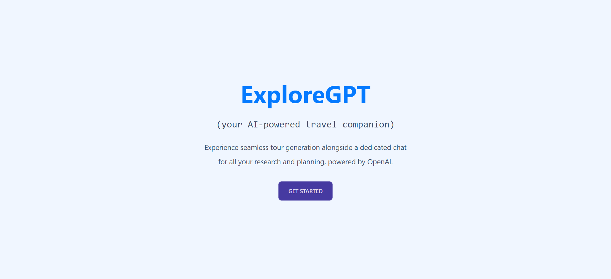
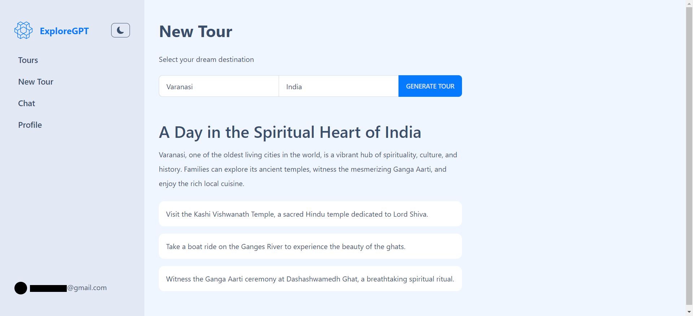
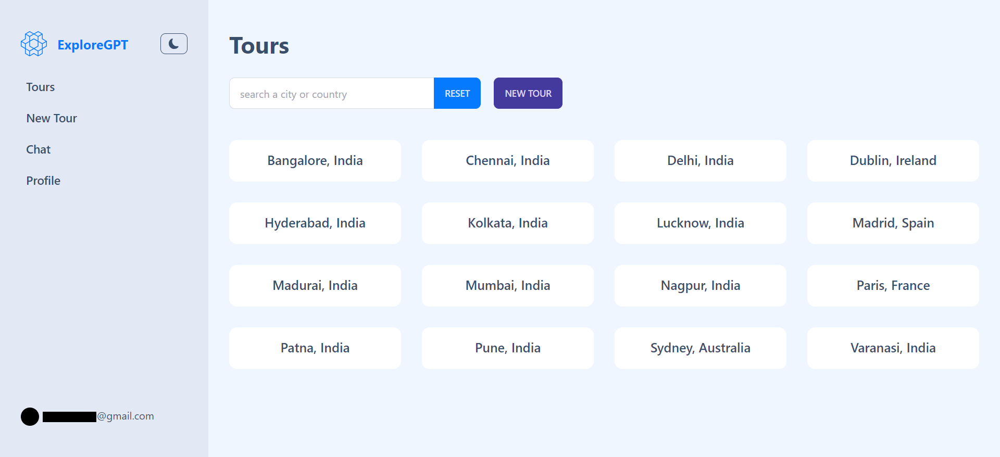
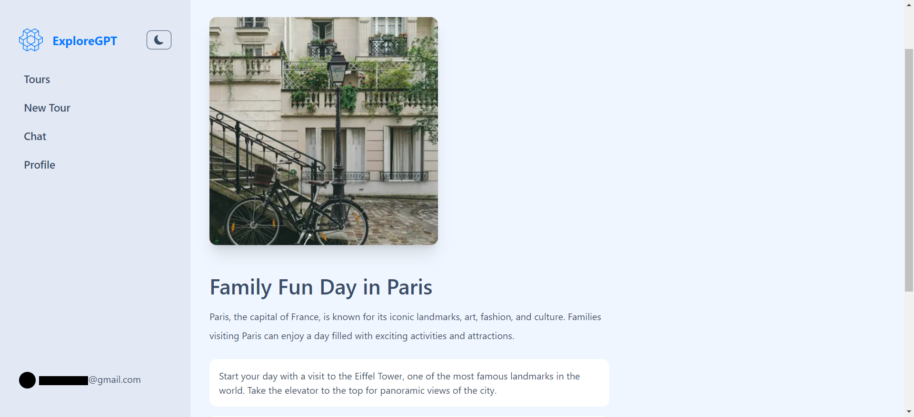
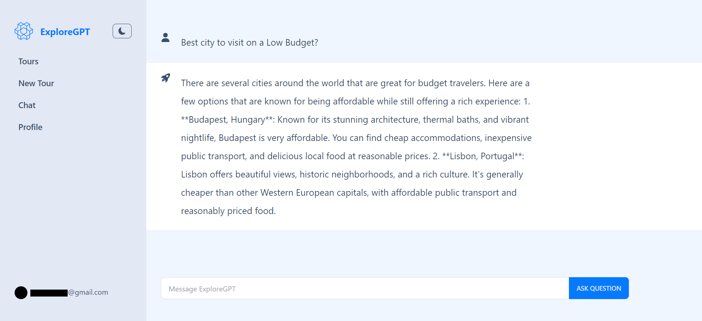
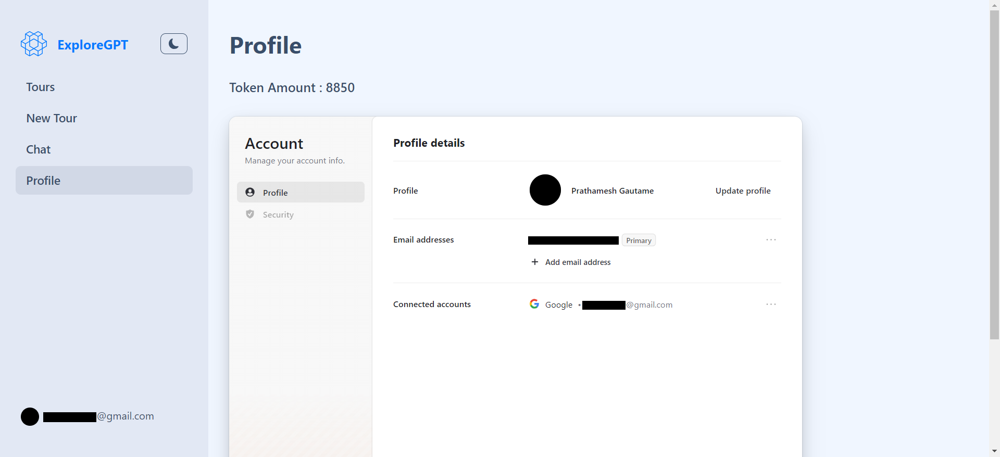

# ExploreGPT

**ExploreGPT** is an AI travel planner, designed to help you discover and plan trips efficiently.

## Features

- **Tour Generation**: Generate a tour itinerary based on your selected destination (city and country).
- **Tour Search**: Browse through previously generated tours by location, enhanced with imagery from Unsplash.
- **Chat Assistance**: Interact with ExploreGPT for any information or queries.
- **Profile Management**: Manage your profile information and track available token balances.
- **Guest Demo**: Experience the app as a guest (limited functionality).

## Technologies Used

- **JavaScript**: The primary programming language used to build the application.
- **Next.js**: React framework for building optimized, server-rendered web applications.
- **Clerk**: Authentication and user management platform.
- **Prisma**: ORM for interacting with the database and managing user data.
- **React Query**: Efficient data fetching and state management.
- **Tailwind CSS & DaisyUI**: For styling and UI components.
- **OpenAI API**: Powered by the `gpt-4o-mini` model for generating tours and answering queries.
- **Unsplash API**: Provides high-quality images for destinations.
- **Supabase**: Used for database management and integration.

## Screenshots

  
_Landing page for ExploreGPT_

  
_Generate new tour based on destination_

  
_Explore generated tours by city or country_

  
_Display selected tour with image and description_

  
_Chat with ExploreGPT for any queries and planning_

  
_Manage your profile and view available token amounts_
